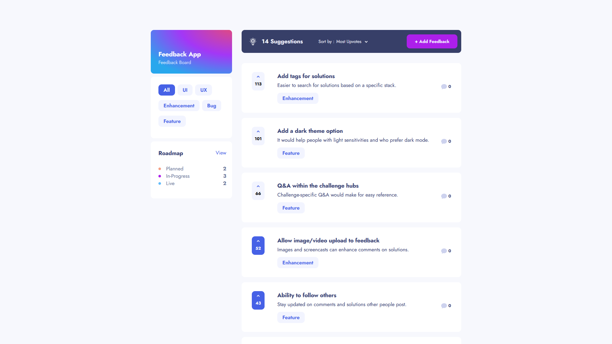

# Product Feedback App

This website is a product feedback app.

## Project Functionality

User can:

- View the optimal layout for the app depending on their device's screen size
- See hover states for all interactive elements on the page
- Create, read, update, and delete product feedback requests
- Receive form validations when trying to create/edit feedback requests
- Sort suggestions by most/least upvotes and most/least comments
- Filter suggestions by category
- Add comments and replies to a product feedback request
- Upvote product feedback requests

You can visit website by clicking [this link](https://github.com)

## Technologies used

- HTML
- Scss
- Flexbox
- Adaptive layout
- JS
- React
- React Router Dom
- Firebase

## How to start

1. Clone the repository: `git clone https://github.com/kanae367/feedback-app`
2. Install all dependencies: `npm install`
3. cp public.env .env
4. Enter your values instead of placeholder inside the .env file
5. Run the app: `npm start`
